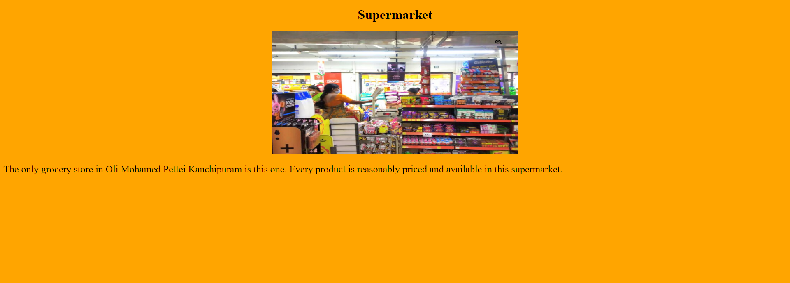

# Places Around Me
## AIM:
To develop a website to display details about the places around my house.

## Design Steps:

### Step 1:
Open up a terminal in your preffered location, and start a django project using djang-admin startproject Next setup an app inside the project folder using django-admin startapp.

### Step 2:
Once Created ,link your app to the project by adding it in the list of apps in settings.py file located inside the project folder. Add access to your host in allowed host setting and add static folders path to your settings.py file.

### Step 3:
Create a static folder and template folder and add all your required files for the project - Images .etc in your static folder. In the Template folder add your html files required for the pages.

### Step 4:
Head to the views.py in your app folder and create required functions to render a particular page or template when requested by the client. Next go to the urls.py and route the correct view functions to each particular request as needed.

### Step 5:
Next start the server from the projects main directory using python3 manage.py runserver 0:. Now the pages can be accessed from all the routed addresses in urls.py.

## Code:
### map
```html
<!DOCTYPE html>
<html>
    <head>
        <title>
            Image Map
        </title>
    </head>
    <body >
        <h1 align="center" >
            <font color="red" >
                    Kanchipuram 
            </font>   
        </h1>
        <h3 align="center">
        <font color="blue">
            Mohammed Faizal.J (212222100027)
        </font>
            
        </h3>
        <center>
            
            <map name="image-map">
            <area  alt="" title="Supermarket" href="http://www.image-maps.com/" shape="rect" coords="1064,580,1153,667" style="outline:none;" target="_self"     />
            <area  alt="" title="Government School" href="http://www.image-maps.com/" shape="rect" coords="772,304,864,393" style="outline:none;" target="_self"     />
            <area  alt="" title="Meat Shop" href="http://www.image-maps.com/" shape="rect" coords="580,189,648,258" style="outline:none;" target="_self"     />
            <area  alt="" title="Mobile Shop" href="http://www.image-maps.com/" shape="rect" coords="807,515,875,584" style="outline:none;" target="_self"     />
            <area  alt="" title="Food Shop" href="http://www.image-maps.com/" shape="rect" coords="963,645,1040,714" style="outline:none;" target="_self"     />
            <area shape="rect" coords="1735,721,1737,723" alt="Image Map" style="outline:none;" title="Image Map" href="https://www.image-maps.com/" />
            </map>

        </center>
        <p align="center">
            <font color="maroon"  face="Comic Sans MS" >
                This Image Map shows various locations around my home.<br>
                Click the location and get information about it.
            </font>
        </p>


    </body>
</html>
```
### Food Shop
```html
<!DOCTYPE html>
<html>
    <head>
        <title>Food Shop</title>
    </head>
    <body bgcolor="blue">
        <h1 align='center'>Food Shop</h1>
        <center>
          
        </center>
        <p style="font-size: 24px">
           Many people come here to buy biriyani because it is a well-known biriyani shop. Some YouTubers visit and try this biriyani, then they upload the video to their channels.
        </p>
    </body>

</html>
```
### Meat Shop
```html
<!DOCTYPE html>
<html>
    <head>
        <title>Meat Shop</title>
    </head>
    <body bgcolor="green">
        <h1 align='center'>Meat Shop</h1>
        <center>
          
        </center>
        <p style="font-size: 24px">
            This is the area's top meat shop. Additionally, there are several offers and you may buy high-quality meat for a reasonable price.
        </p>
    </body>

</html>
```
### Mobile Shop
```html
<!DOCTYPE html>
<html>
    <head>
        <title>Mobile Shop</title>
    </head>
    <body bgcolor="yellow">
        <h1 align='center'>Mobile Shop</h1>
        <center>
          
        </center>
        <p style="font-size: 24px">
            This mobile store offers more affordable mobile accessories. Additionally, they fix every smartphone model.
        </p>
    </body>

</html>
```
### Government School
```html
<!DOCTYPE html>
<html>
    <head>
        <title>Government School</title>
    </head>
    <body bgcolor="red">
        <h1 align='center'>Government School</h1>
        <center>
          
        </center>
        <p style="font-size: 24px">
           A Government school that educates all students without charge. Such schools are funded in whole or in part by taxation. State-funded schools exist in virtually every country of the world, though there are significant variations in their structure and educational programmes.
        </p>
    </body>

</html>
```
### Supermarket
```html
<!DOCTYPE html>
<html>
    <head>
        <title>Supermarket</title>
    </head>
    <body bgcolor="orange">
        <h1 align='center'>Supermarket</h1>
        <center>
          
        </center>
        <p style="font-size: 24px">
            The only grocery store in Oli Mohamed Pettei Kanchipuram is this one. Every product is reasonably priced and available in this supermarket.
        </p>
    </body>

</html>
```

## Output:

### map


### Food Shop


### Meat Shop


### Mobile Shop


### Government School


### Supermarket


### Html Check


## Result:
Thus the code has been executed successfully.
